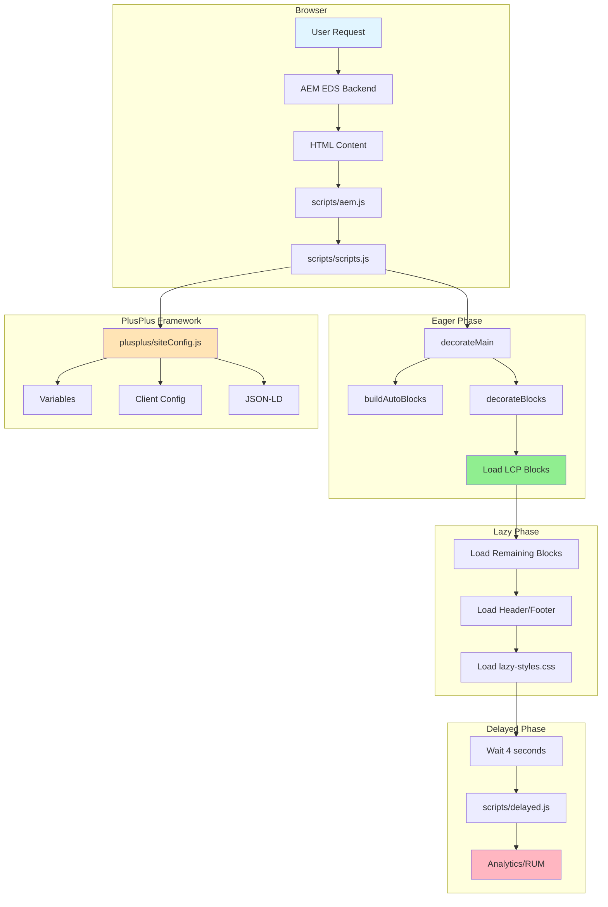

# AllAbout V2 Project Review

**Reviewer:** Roo (AI Architect)  
**Date:** 2025-10-01  
**Project Owner:** Tom Cranstoun (@ddttom)

## Executive Summary

This comprehensive review of the AllAbout V2 AEM Edge Delivery Services project identifies strengths, weaknesses, and actionable recommendations across architecture, code quality, performance, accessibility, and documentation.

### Overall Assessment: **Good Foundation with Areas for Improvement**

**Strengths:**
- Well-structured AEM EDS implementation following Adobe standards
- Extensive block library (35+ blocks) demonstrating rich functionality
- Good documentation foundation with AGENTS.md and comprehensive README
- Custom development server for improved AI-assisted workflows
- Clear commitment to simplicity and performance (no TypeScript, no build tools)

**Critical Issues:**
- Inconsistent code quality across blocks
- CSS organization needs standardization
- Missing accessibility features in several blocks
- Incomplete documentation for many blocks
- Performance optimization opportunities not fully leveraged

---

## 1. Architecture Review

### 1.1 Project Structure ✅ GOOD

The project follows AEM EDS conventions with appropriate separation of concerns:

```
├── blocks/          # 35+ reusable blocks
├── scripts/         # Core EDS scripts (aem.js, scripts.js, delayed.js)
├── styles/          # Global styles
├── plusplus/        # Custom site configuration framework
├── docs/            # Documentation
└── config/          # Configuration files
```

**Strengths:**
- Clear separation between core EDS files and custom code
- Logical block organization
- Custom `plusplus` framework for site configuration

**Issues:**
- Some blocks have inconsistent file structures (missing README, test files)
- `plusplus` framework adds complexity that may not align with EDS simplicity goals
- Build artifacts in repository ([`build/spectrum-card/`](build/spectrum-card/))

### 1.2 Module System ⚠️ NEEDS ATTENTION

**Current State:**
- ES modules used throughout (✅ correct for EDS)
- [`package.json`](package.json:5) declares `"type": "module"`
- Imports use `.js` extensions (✅ follows ESLint rules)

**Issues:**
- [`scripts/scripts.js`](scripts/scripts.js:23) has empty import: `import { } from '/plusplus/src/siteConfig.js';`
- Some blocks may have circular dependencies
- No clear module dependency documentation

### 1.3 Page Loading Strategy ✅ GOOD

Three-phase loading properly implemented in [`scripts/scripts.js`](scripts/scripts.js:130-215):
- **Eager:** LCP optimization, template decoration
- **Lazy:** Header/footer, remaining blocks
- **Delayed:** Analytics, non-critical features (4-second delay)

**Recommendation:** Document which blocks should be in `LCP_BLOCKS` array (currently empty at line 25)

---

## 2. Code Quality Analysis

### 2.1 JavaScript Quality ⚠️ MIXED

**ESLint Configuration:** Well-configured in [`.eslintrc.js`](.eslintrc.js:1-25)
- Airbnb base rules
- Appropriate overrides for EDS patterns
- Max line length: 100 characters

**Issues Found:**

#### [`blocks/hero/hero.js`](blocks/hero/hero.js:1-19)
```javascript
export default function decorate(block) {
  const firstPicture = document.querySelector('.hero > div:first-of-type picture');
  const secondPicture = document.querySelector('.hero > div:first-of-type > div:nth-of-type(2) picture');
```

**Problems:**
1. ❌ Unused `block` parameter - should use it for scoped queries
2. ❌ Global `document.querySelector` instead of `block.querySelector`
3. ❌ No error handling
4. ❌ No JSDoc comments
5. ❌ Complex selectors that are fragile

**Should be:**
```javascript
/**
 * Decorates the hero block by managing picture elements
 * @param {Element} block The hero block element
 */
export default function decorate(block) {
  const firstDiv = block.querySelector(':scope > div:first-of-type');
  if (!firstDiv) return;
  
  const firstPicture = firstDiv.querySelector('picture');
  const secondPicture = firstDiv.querySelector('div:nth-of-type(2) picture');
  
  if (!firstPicture || !secondPicture) return;
  // ... rest of logic
}
```

#### [`scripts/scripts.js`](scripts/scripts.js:1-217)
**Issues:**
- Line 23: Empty import statement
- Line 25: Empty `LCP_BLOCKS` array needs documentation
- Lines 1-2: Multiple ESLint disable comments suggest code smell
- Line 131: Direct console.log usage (should use debug utility)

### 2.2 CSS Quality ⚠️ NEEDS IMPROVEMENT

#### [`blocks/hero/hero.css`](blocks/hero/hero.css:1-102)

**Critical Issues:**

1. **Not Mobile-First** (violates EDS standards):
```css
main .hero {
    min-height: 1000px;  /* ❌ Too large for mobile */
}
```

2. **Overly Specific Selectors:**
```css
body.techem .hero-wrapper, .hero-wrapper * {  /* ❌ Universal selector */
    color: white;
}
```

3. **Inconsistent Units:**
- Mix of `px`, `rem`, `pc` (picas!)
- Line 94: `max-width: 77pc;` (unusual unit choice)

4. **Missing Responsive Breakpoints:**
- No `@media (width >= 600px)` queries
- No `@media (width >= 900px)` queries
- Violates EDS standard breakpoints

5. **Typo in Selector:**
```css
body.techem hero-wrapper a {  /* ❌ Missing dot before hero-wrapper */
    color: white;
}
```

**Recommended Structure:**
```css
/* Mobile-first base styles */
main .hero {
    min-height: 300px;
    padding: 1rem;
}

/* Tablet */
@media (width >= 600px) {
    main .hero {
        min-height: 500px;
        padding: 2rem;
    }
}

/* Desktop */
@media (width >= 900px) {
    main .hero {
        min-height: 600px;
        padding: 3rem;
    }
}
```

### 2.3 Global Styles ✅ MOSTLY GOOD

[`styles/styles.css`](styles/styles.css:1-219) follows EDS patterns well:
- CSS custom properties for theming
- Proper font fallback strategy
- Responsive typography
- Modern CSS features (Grid, Flexbox)

**Minor Issues:**
- Line 219: Incomplete rule (missing closing brace)
- [`styles/lazy-styles.css`](styles/lazy-styles.css:1) is empty (opportunity for optimization)

---

## 3. Performance Analysis

### 3.1 Current Performance Strategy ✅ GOOD FOUNDATION

**Strengths:**
- Three-phase loading implemented
- Font loading optimization (lines 77-84, 151-157 in [`scripts/scripts.js`](scripts/scripts.js))
- Lazy loading for header/footer
- 4-second delay for analytics

**Opportunities:**

1. **Empty LCP_BLOCKS Array**
   - Line 25 in [`scripts/scripts.js`](scripts/scripts.js:25): `const LCP_BLOCKS = [];`
   - Should identify and add LCP-critical blocks (likely `hero`)

2. **Unused Lazy Styles**
   - [`styles/lazy-styles.css`](styles/lazy-styles.css:1) is empty
   - Move non-critical CSS here

3. **Font Loading**
   - Only 2 font files: [`fonts/roboto-bold.woff2`](fonts/roboto-bold.woff2), [`fonts/roboto-regular.woff2`](fonts/roboto-regular.woff2)
   - Good: Using WOFF2 format ✅
   - Consider: Font subsetting for further optimization

4. **Image Optimization**
   - Many SVG icons (good for performance)
   - Need to verify all raster images are optimized

### 3.2 Bundle Size Concerns ⚠️

**Large Block Count:** 35+ blocks could impact initial load
- Consider: Lazy loading less-used blocks
- Consider: Code splitting for complex blocks

**PlusPlus Framework:** Adds overhead
- [`plusplus/src/siteConfig.js`](plusplus/src/siteConfig.js:1-117) - 117 lines
- Multiple imports and initialization chains
- May impact LCP

---

## 4. Accessibility Review

### 4.1 Global Accessibility ⚠️ NEEDS ATTENTION

**Good Practices:**
- Semantic HTML encouraged in guidelines
- ARIA attributes in header navigation ([`blocks/header/header.js`](blocks/header/header.js:11-47))
- Keyboard navigation support (Escape key, Enter/Space)

**Issues:**

1. **Missing Language Declaration**
   - [`scripts/scripts.js`](scripts/scripts.js:132): `document.documentElement.lang = 'en';`
   - ✅ Good, but should be in HTML template

2. **Hero Block Accessibility**
   - No alt text validation for images
   - No ARIA labels for decorative images
   - Background images may hide content from screen readers

3. **Color Contrast**
   - [`blocks/hero/hero.css`](blocks/hero/hero.css:42-43): White text on images
   - No contrast validation
   - Need to ensure 4.5:1 ratio for normal text

4. **Focus Management**
   - Header has focus management ✅
   - Need to verify across all interactive blocks

### 4.2 Recommendations

1. Add accessibility testing to development workflow
2. Implement automated contrast checking
3. Add ARIA landmarks to all blocks
4. Ensure all images have appropriate alt text
5. Test with screen readers (NVDA, JAWS, VoiceOver)

---

## 5. Documentation Review

### 5.1 Project Documentation ✅ GOOD

**Excellent:**
- [`AGENTS.md`](AGENTS.md:1-138) - Comprehensive AI agent guidelines
- [`README.md`](README.md:1-138) - Clear project overview
- [`docs/Server-README.md`](docs/Server-README.md) - Development server docs
- Multiple AI-focused guides in [`docs/for-ai/`](docs/for-ai/)

**Good:**
- Clear development requirements
- Setup instructions
- Code style guidelines

### 5.2 Block Documentation ⚠️ INCONSISTENT

**Issues:**
- Many blocks lack README files
- Inconsistent documentation format
- Missing usage examples for most blocks
- No EXAMPLE.md files for many blocks (mentioned in README but not present)

**Example of Good Documentation:**
- [`blocks/code-expander/README.md`](blocks/code-expander/README.md)
- [`blocks/showcaser/README.md`](blocks/showcaser/README.md)

**Blocks Needing Documentation:**
- [`blocks/hero/`](blocks/hero/) - No README
- [`blocks/columns/`](blocks/columns/) - No README
- [`blocks/grid/`](blocks/grid/) - No README
- Many others

### 5.3 Code Comments ⚠️ SPARSE

Most blocks lack:
- JSDoc function documentation
- Inline comments explaining complex logic
- Parameter descriptions
- Return value documentation

---

## 6. Security Assessment

### 6.1 Current Security Posture ✅ ACCEPTABLE

**Good Practices:**
- No sensitive data in repository ✅
- Client-side only (appropriate for EDS) ✅
- No authentication/authorization (not needed) ✅
- HTTPS enforced in production ✅

**Concerns:**

1. **Google Drive Integration**
   - [`fstab.yaml`](fstab.yaml:2): Public Google Drive folder
   - Ensure proper access controls on Drive

2. **External Dependencies**
   - Minimal dependencies ✅
   - Need regular security updates
   - Consider: Dependabot for automated updates

3. **Content Security**
   - All code is client-side and public
   - No XSS vulnerabilities identified
   - DOM manipulation uses safe methods

### 6.2 Recommendations

1. Add `.hlxignore` file to prevent serving sensitive files
2. Implement Content Security Policy headers
3. Regular dependency audits (`npm audit`)
4. Document security considerations for block developers

---

## 7. Dependency Management

### 7.1 Current Dependencies ✅ MINIMAL

[`package.json`](package.json:23-32) - Only dev dependencies:
```json
{
  "@babel/core": "7.23.7",
  "@babel/eslint-parser": "7.23.3",
  "chai": "5.0.0",
  "eslint": "^8.56.0",
  "eslint-config-airbnb-base": "^15.0.0",
  "eslint-plugin-import": "^2.29.1",
  "stylelint": "16.1.0",
  "stylelint-config-standard": "36.0.0"
}
```

**Strengths:**
- Zero runtime dependencies ✅
- All dependencies are dev tools ✅
- Aligns with simplicity goals ✅

**Issues:**
- Some dependencies may be outdated
- No automated update process
- Chai included but no tests visible

### 7.2 Recommendations

1. Update dependencies to latest stable versions
2. Add `package-lock.json` to version control (already present ✅)
3. Set up Dependabot or Renovate for automated updates
4. Remove unused dependencies (Chai if no tests)

---

## 8. Testing Strategy

### 8.1 Current State ❌ MINIMAL

**Observations:**
- Chai testing library installed
- No visible test files
- No test scripts in [`package.json`](package.json:7-11)
- Manual testing via development server

**Impact:**
- Higher risk of regressions
- Difficult to validate changes
- No automated quality gates

### 8.2 Recommendations

**Priority 1: Add Linting to CI/CD**
```json
{
  "scripts": {
    "test": "npm run lint",
    "lint": "npm run lint:js && npm run lint:css"
  }
}
```

**Priority 2: Consider Adding:**
- Visual regression testing (Percy, Chromatic)
- Accessibility testing (axe-core)
- Performance budgets (Lighthouse CI)
- Unit tests for complex blocks

---

## 9. Specific Block Issues

### 9.1 Hero Block

**File:** [`blocks/hero/hero.js`](blocks/hero/hero.js:1-19)

**Issues:**
1. Fragile DOM selectors
2. No error handling
3. Unused parameter
4. No documentation

**File:** [`blocks/hero/hero.css`](blocks/hero/hero.css:1-102)

**Issues:**
1. Not mobile-first
2. Hardcoded 1000px min-height
3. Missing responsive breakpoints
4. Selector typo (line 45)
5. Inconsistent units

### 9.2 Header Block

**File:** [`blocks/header/header.js`](blocks/header/header.js:1-50)

**Strengths:**
- Good accessibility (keyboard navigation)
- Proper ARIA attributes
- Event handling

**Issues:**
- Complex function interdependencies
- Could benefit from more comments

### 9.3 PlusPlus Framework

**File:** [`plusplus/src/siteConfig.js`](plusplus/src/siteConfig.js:1-117)

**Concerns:**
1. Adds complexity to simple EDS model
2. Multiple initialization chains
3. May impact performance
4. Not standard EDS pattern

**Recommendation:** Evaluate if this framework is necessary or if standard EDS patterns would suffice

---

## 10. Priority Recommendations

### 🔴 Critical (Do First)

1. **Fix Hero Block CSS**
   - Implement mobile-first approach
   - Add proper responsive breakpoints
   - Fix selector typo
   - Use consistent units

2. **Fix Hero Block JavaScript**
   - Use scoped queries with `block` parameter
   - Add error handling
   - Add JSDoc documentation

3. **Populate LCP_BLOCKS Array**
   - Add `hero` and other LCP-critical blocks
   - Document why each block is included

4. **Add Missing Documentation**
   - Create README for all blocks
   - Add usage examples
   - Document block contracts (expected DOM structure)

### 🟡 Important (Do Soon)

5. **Standardize CSS Across Blocks**
   - Enforce mobile-first approach
   - Use standard breakpoints (600px, 900px, 1200px)
   - Consistent unit usage (prefer rem)

6. **Improve Accessibility**
   - Add ARIA labels where missing
   - Implement contrast checking
   - Test with screen readers

7. **Optimize Performance**
   - Move non-critical CSS to [`styles/lazy-styles.css`](styles/lazy-styles.css)
   - Consider lazy loading for less-used blocks
   - Optimize images

8. **Update Dependencies**
   - Update to latest stable versions
   - Set up automated dependency updates
   - Remove unused dependencies

### 🟢 Nice to Have (Do Later)

9. **Add Testing**
   - Set up visual regression testing
   - Add accessibility testing
   - Implement performance budgets

10. **Evaluate PlusPlus Framework**
    - Assess if it's necessary
    - Consider simplifying or removing
    - Document if keeping

11. **Improve Development Workflow**
    - Add pre-commit hooks for linting
    - Set up CI/CD pipeline
    - Add automated PSI checks

---

## 11. Code Quality Metrics

### Current State

| Metric | Status | Target |
|--------|--------|--------|
| ESLint Compliance | ⚠️ Unknown | 100% |
| Stylelint Compliance | ⚠️ Unknown | 100% |
| Block Documentation | ❌ ~30% | 100% |
| Test Coverage | ❌ 0% | 80%+ |
| Accessibility Score | ⚠️ Unknown | 95+ |
| Performance Score | ⚠️ Unknown | 95+ |

### Recommended Actions

1. Run `npm run lint` and fix all issues
2. Document all blocks with README files
3. Add accessibility testing
4. Set up Lighthouse CI for performance monitoring

---

## 12. Architecture Diagram



---

## 13. Conclusion

### Summary

The AllAbout V2 project demonstrates a solid understanding of AEM Edge Delivery Services principles with a strong foundation in place. The project successfully maintains simplicity by avoiding TypeScript and build tools, while providing extensive functionality through 35+ blocks.

### Key Strengths

1. ✅ Proper AEM EDS architecture
2. ✅ Extensive block library
3. ✅ Good documentation foundation
4. ✅ Minimal dependencies
5. ✅ Custom development tooling

### Key Weaknesses

1. ❌ Inconsistent code quality across blocks
2. ❌ CSS not following mobile-first principles
3. ❌ Missing documentation for many blocks
4. ❌ No automated testing
5. ❌ Accessibility gaps

### Overall Grade: **B-** (Good with room for improvement)

With focused effort on the critical recommendations, this project could easily achieve an **A** grade. The foundation is solid; it needs consistency and polish.

---

## 14. Next Steps

### Immediate Actions (This Week)

1. Run `npm run lint` and fix all linting errors
2. Fix hero block CSS and JavaScript
3. Add LCP blocks to configuration
4. Create README files for undocumented blocks

### Short-term Actions (This Month)

1. Standardize CSS across all blocks
2. Implement accessibility improvements
3. Update dependencies
4. Add basic testing infrastructure

### Long-term Actions (This Quarter)

1. Comprehensive accessibility audit
2. Performance optimization
3. Evaluate PlusPlus framework necessity
4. Set up CI/CD pipeline

---

## 15. Resources

### AEM EDS Documentation
- [AEM Live Documentation](https://www.aem.live/docs/)
- [Developer Tutorial](https://www.aem.live/developer/tutorial)
- [Keeping it 100](https://www.aem.live/developer/keeping-it-100)

### Code Quality Tools
- [ESLint](https://eslint.org/)
- [Stylelint](https://stylelint.io/)
- [axe DevTools](https://www.deque.com/axe/devtools/)

### Testing Tools
- [Lighthouse CI](https://github.com/GoogleChrome/lighthouse-ci)
- [Percy](https://percy.io/)
- [Playwright](https://playwright.dev/)

---

**End of Review**

*This review was conducted by an AI architect and should be validated by human developers familiar with the project context and business requirements.*